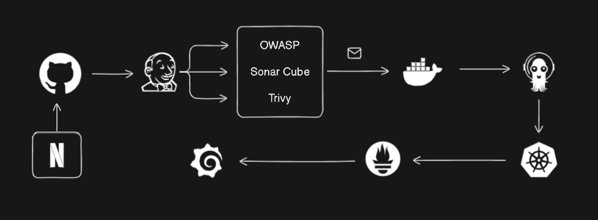

# Netflix Clone Deployment - DevSecOps Project


I got this code from [Github Netflix Clone](https://github.com/jason-liu22/netflix-clone-react-typescript). He did a great job. I just forked it and added:

1. Improved Dockerfile
2. Resolved Yarn Lock Issues
3. Added Jenkinfile
4. Added Kubernetes Manifets

I am doing this **DevSecOps Project** for better understand of different softwares using differnet new and modern techniques. If you want to colloborate then you can visit my 

- [LinkedIn](https://www.linkedin.com/in/muhammadabdullahabrar)
- [Github](https://www.github.com/Abdullah-0-3)
- **Email:** abdullahabrar4843@gmail.com
- **Phone Number:** +(92) 3095306826

I hope if you try this project you will get a better understanding of projects and using new techniques like Grafana and Prometheus. 

---
### Tools Used

- Jenkins
- Docker
- Kuberentes
- ArgoCD
- OWASP
- SonarCube
- Trivy
- Prometheus
- Grafana

---
### DevSecOps Project Architecture



From Netflix Code to Github. Github to Jenkins and using OWASP, SonaryCube and Trivy to check Dependencies and and Pushing made images to Dockerhub.

Using Dockerhub image to use for K8s using from ArgoCD. After that integreating it to Prometheus and using Grafana Dashboards to view the Analytics

---
### Overview of Neflix Clone


---
### Prerequisite

1. Clone the Repository
  ```
  git clone https://github.com/Abdullah-0-3/NetflixCloneTypescript.git
  ```
2. Install [Docker](#docker-installation)
3. Install Dependencies
  You should be in the place where you cloned the repo
  ```
  cd downloads
  chmod +x install_kubectl.sh
  chmod +x install_kind.sh
  chmod +x install_helm.sh
  ```
  After this process run the scripts
  ```
  sudo ./install_kubectl.sh
  sudo ./install_kind.sh
  sudo ./install_helm.sh
  ```
  Checking if it runs
  ```
  kubectl version --client
  kind version
  kind create cluster --config kind-config.yml
  kubectl get nodes
  ```
  If did not work then check if **Docker** is installed.

4. Go to [TMDB](https://www.themoviedb.org/).
    - Rgister an Account
    - Log into you Account
    - Go to Settings
    - Genereate and API by filling all the requirements for the API Key
    - Copy and Store it in a safe spot.
5. Check if you are ready to go by checking if Kuberentes Nodes are Ready, Linux is set and make sure you update it

> (Recomendation) Make sure you give your machine 8GB Ram and 15GB Hard Disk.

---
### Docker Installation
1. Update System
  ```
  sudo dnf update -y
  ```
2. Install Packages
  ```
  sudo dnf install -y dnf-utils
  sudo dnf config-manager --add-repo https://download.docker.com/linux/centos/docker-ce.repo
  ```
3. Download Docker
  ```
  sudo dnf install -y docker-ce docker-ce-cli containerd.io
  docker --version
  ```
4. Start Docker
  ```
  sudo systemctl start docker
  sudo systemctl enable docker
  ```
5. Give Permissions
  ```
  sudo usermod -aG docker $USER
  ```

---
### Jenkins Setup

1. Install Java
  ```
  sudo dnf update -y
  sudo dnf install fontconfig java-17-openjdk -y
  java --version
  ```
2. Get Go with Jenkins
  ```
  sudo wget -O /etc/yum.repos.d/jenkins.repo https://pkg.jenkins.io/redhat-stable/jenkins.repo
  sudo rpm --import https://pkg.jenkins.io/redhat-stable/jenkins.io-2023.key
  sudo dnf install jenkins -y
  ```
3. Start Jenkins
  ```
  sudo systemctl start jenkins
  sudo systemctl status jenkins
  ```
  It runs on port 8080
  
4. Open Ports
  If you are using AWS Instance Security Bind your ports
  ```
  sudo firewall-cmd --permanent --add-port=8080/tcp --zone=public
  sudo firewall-cmd --reload
  ```
5. You can use jenkins is your Browser
  ```
  sudo usermod -aG docker jenkins
  ```
6. Create a Pipeline and use it for further configuration
7. Setup your Jenkins Pipeline for that you need to learn Jenkins

> Jenkins Downloads
- SonarQube Scanner
- SonarQube Quality Gates
- NodeJS
- Docker
- Pipeline Stage View
- OWASP Dependecy Check

> Jenkins Credentials
- Email Credentials 
- Docker Credentials
- TMDB Secret File
- SonarQube Administrator Token

---
### SonarCube Setup
1. Start Docker
  ```
  sudo systemctl start docker
  ```
2. Pull SonarCube image
  ```
  docker pull sonarqube:lts-community
  ```
3. Run SonarCube
  ```
  docker run --name sonarqube -d -p 9000:9000 sonarqube:lts-community
  ```
4. Allow Firewall
  ```
  sudo firewall-cmd --permanent --zone=public --add-port=9000/tcp
  sudo firewall-cmd --reload
  ```
5. Ready to GO!

> Create a WebHook
> Apply Admin Token in Jenkins

---
### Trivy Setup
1. Update System
  ```
  sudo dnf update -y
  ```
2. Import Packages
  ```
  sudo vim /etc/yum.repos.d/trivy.repo
  ```
  Paste it there
  ```
  [trivy]
  name=Trivy repository
  baseurl=https://aquasecurity.github.io/trivy-repo/rpm/releases/$releasever/$basearch/
  gpgcheck=0
  enabled=1
  ```
3. Download Trviy
  ```
  sudo dnf -y update
  sudo dnf -y install trivy
  ```
4. Check Trivy Version
  ```
  trivy --version
  ```
5. Done!!!!

---
### ArgoCD Setup

> Kubernetes Cluster should be Running
1. Create ArgoCD Namespace
  ```
  kubectl create namespace argocd
  ```
2. Apply ArgoCD Manifets
  ```
  kubectl apply -n argocd -f https://raw.githubusercontent.com/argoproj/argo-cd/stable/manifests/install.yaml
  ```
3. Check ArgoCD Service
  ```
  kubectl get svc -n argocd
  ```
4. Service to NodePort
  ```
  kubectl patch svc argocd-server -n argocd -p '{"spec": {"type": "NodePort"}}'
  ```
5. Expose Port 8443
  ```
  kubectl port-forward -n argocd service/argocd-server 8443:443 --address=0.0.0.0 &
  ```
6. Firewall Expose
  ```
  sudo firewall-cmd --permanent --zone=public --add-port=8443/tcp
  sudo firewall-cmd --reload
  ```
7. Get ArgoCD Password
  ```
  kubectl get secret -n argocd argocd-initial-admin-secret -o jsonpath="{.data.password}" | base64 -d && echo
  ```
  Use this in Login to ArgoCD
  
8. You can use ArgoCD

> Add all the things to start K8s.
> 
> You need to first learn it!

---
### Prometheus & Grafana Setup

> Install Helm

1. Helm Repository Initilization
  ```
  helm repo add prometheus-community https://prometheus-community.github.io/helm-charts
  helm repo add stable https://charts.helm.sh/stable
  helm repo update
  ```
2. Creating a namespace
  ```
  kubectl create namespace monitoring
  ```
3. Paste this command
  ```
  helm install kind-prometheus prometheus-community/kube-prometheus-stack --namespace monitoring \
  --set prometheus.service.nodePort=30000 \
  --set prometheus.service.type=NodePort \
  --set grafana.service.nodePort=31000 \
  --set grafana.service.type=NodePort \
  --set alertmanager.service.nodePort=32000 \
  --set alertmanager.service.type=NodePort \
  --set prometheus-node-exporter.service.nodePort=32001 \
  --set prometheus-node-exporter.service.type=NodePort
  ```
4. Verify Deployments
  ```
  kubectl get pods -n monitoring
  kubectl get svc -n monitoring
  ```
5. Port Forward 
  ```
  kubectl port-forward svc/kind-prometheus-kube-prome-prometheus -n monitoring 9090:9090 --address=0.0.0.0 &
  kubectl port-forward svc/kind-prometheus-grafana -n monitoring 31000:80 --address=0.0.0.0 &
  ```
6. Exposing Port
  ```
  sudo firewall-cmd --permanent --zone=public --add-port=9090/tcp
  sudo firewall-cmd --permanent --zone=public --add-port=31000/tcp
  sudo firewall-cmd --reload
  ```
> You are Ready to Go!

---